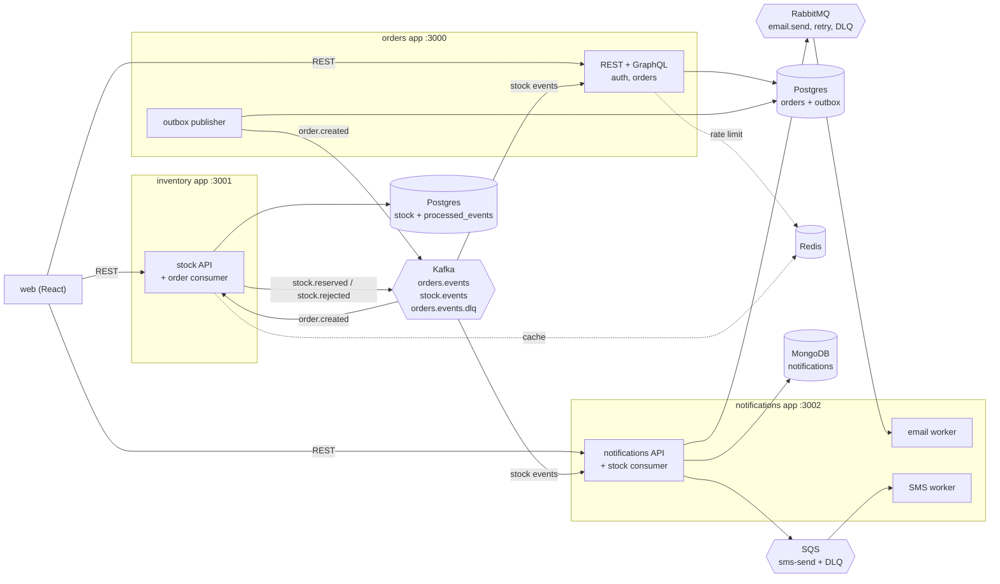
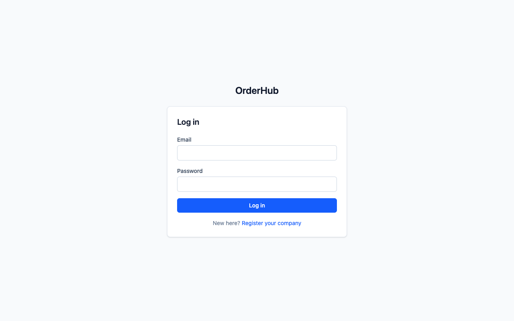
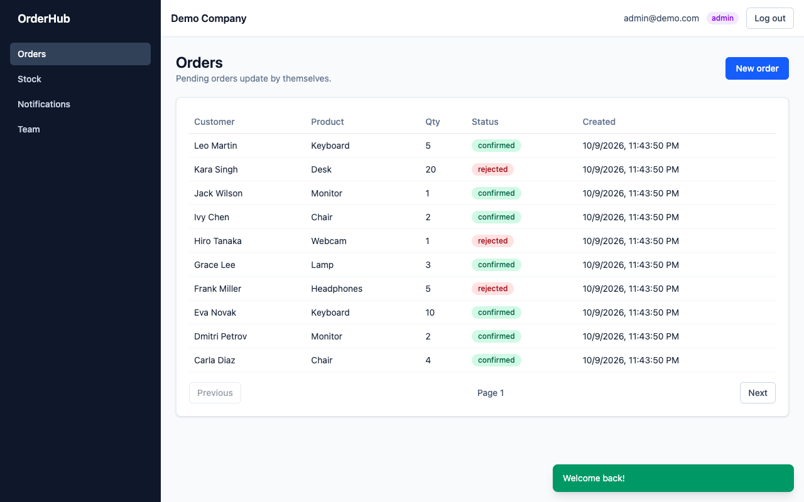
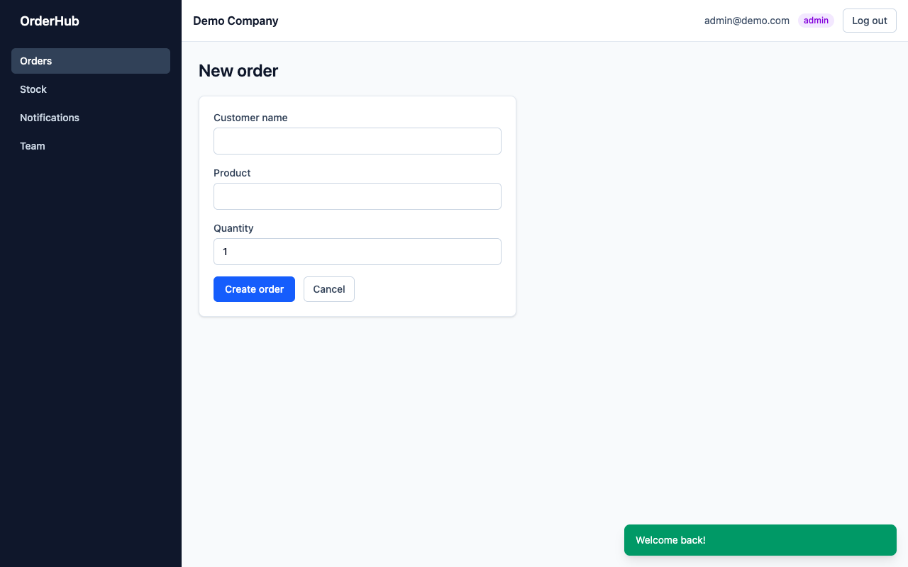
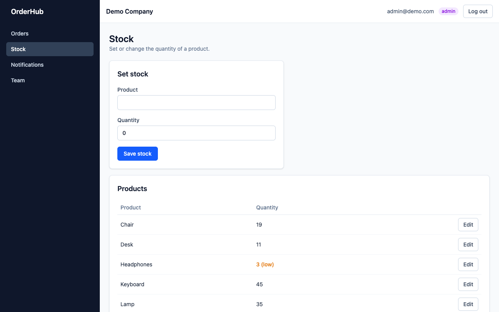
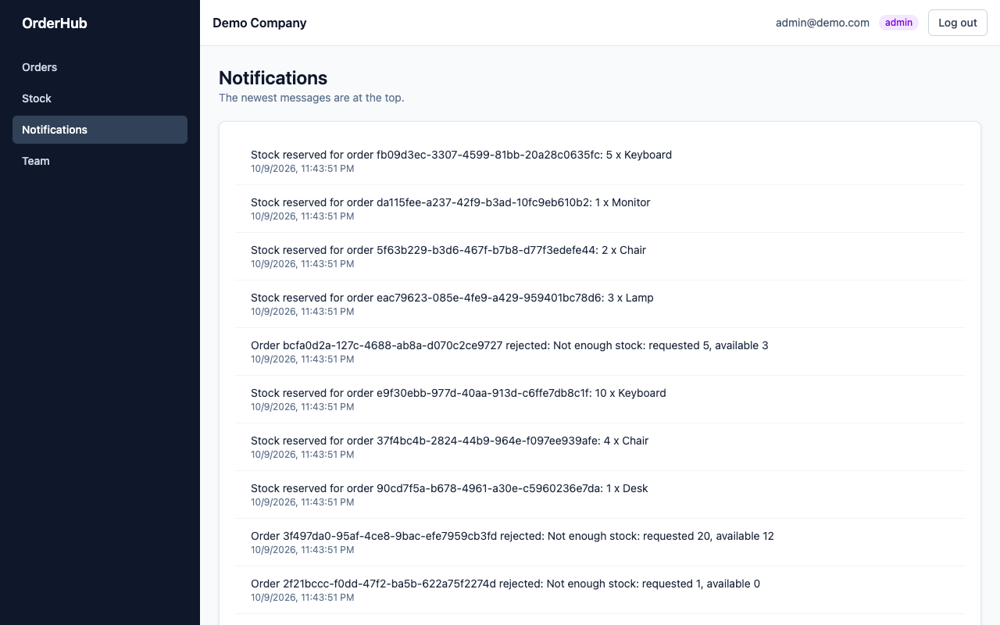
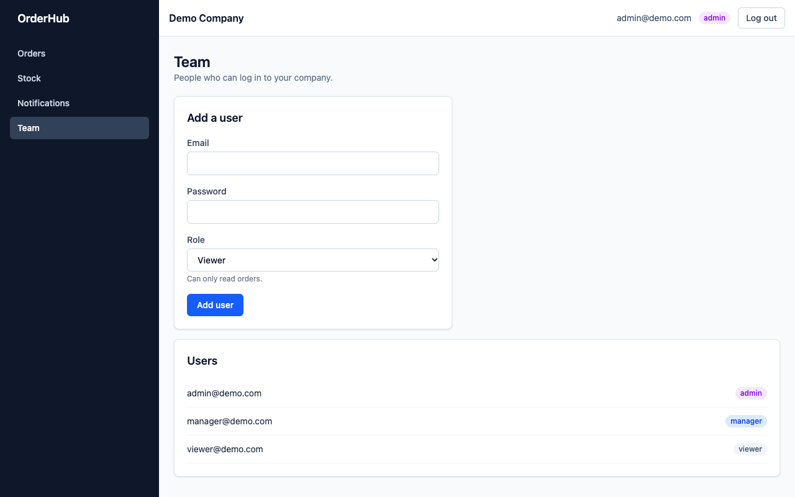

# OrderHub

OrderHub is a small multi-tenant order platform. Many companies (tenants) use the same system, and each company sees only its own data.

It is a learning project. It is built with NestJS, TypeORM, PostgreSQL, Kafka, Redis, MongoDB, RabbitMQ and SQS (LocalStack), with a small React frontend.

## What it does

- A company registers and gets an admin user. Admins can add managers and viewers.
- Users log in with email and password, or with Google. They get a JWT.
- Admins and managers create orders. Viewers can only read.
- Every order asks the inventory service for stock. The order becomes `confirmed` or `rejected`.
- Every stock result creates a notification, and sends an email job (RabbitMQ) and an SMS job (SQS).
- A tenant can never read another tenant's data.

## Architecture



Each app has its own database (or none). Apps never call each other directly. They only exchange events.

## How to run it

You need Node 24, pnpm and Docker.

1. Copy the settings and start the infrastructure:

   ```bash
   cp .env.example .env        # then set JWT_SECRET to a long random string
   docker compose up -d
   pnpm install
   ```

   This starts two Postgres databases, Kafka (with the topics), Redis, MongoDB, RabbitMQ and LocalStack, plus these web tools:

   | Tool | Address | Login |
   |---|---|---|
   | Kafka UI | http://localhost:8080 | none |
   | RabbitMQ | http://localhost:15672 | `RABBITMQ_USER` / `RABBITMQ_PASSWORD` from `.env` |
   | Adminer (PostgreSQL) | http://localhost:8081 | System `PostgreSQL`, server `postgres` (orders) or `inventory-db` (inventory), user, password and database from `.env` |
   | mongo-express (MongoDB) | http://localhost:8082 | `MONGO_EXPRESS_USER` / `MONGO_EXPRESS_PASSWORD` from `.env` |
   | RedisInsight (Redis) | http://localhost:5540 | none. Add a database with host `redis`, port `6379` |

2. Start the three apps, each in its own terminal:

   ```bash
   pnpm start:dev:orderhub
   pnpm start:dev:inventory
   pnpm start:dev:notifications
   ```

3. Start the frontend (optional) and open http://localhost:5173:

   ```bash
   cd web && pnpm install && pnpm dev
   ```

4. Try it:

   ```bash
   curl -X POST localhost:3000/auth/register -H 'content-type: application/json' \
     -d '{"companyName":"Acme","email":"admin@acme.com","password":"secret123"}'
   curl -X POST localhost:3000/auth/login -H 'content-type: application/json' \
     -d '{"email":"admin@acme.com","password":"secret123"}'
   # use the accessToken:
   curl -X PUT localhost:3001/stock -H "authorization: Bearer $TOKEN" -H 'content-type: application/json' \
     -d '{"product":"Lamp","quantity":5}'
   curl -X POST localhost:3000/orders -H "authorization: Bearer $TOKEN" -H 'content-type: application/json' \
     -d '{"customerName":"Ann","product":"Lamp","quantity":1}'
   curl localhost:3000/orders -H "authorization: Bearer $TOKEN"
   curl localhost:3002/notifications -H "authorization: Bearer $TOKEN"
   ```

   GraphQL is at `POST /graphql` (queries `orders`, `order(id)`, mutation `createOrder`).

### Demo data and login

With the three apps running, fill the system with demo data (safe to run twice):

```bash
pnpm seed
```

Then open http://localhost:5173 and log in:

| Email | Password | Role |
|---|---|---|
| `admin@demo.com` | `Demo12345` | admin |
| `manager@demo.com` | `Demo12345` | manager |
| `viewer@demo.com` | `Demo12345` | viewer |

The seed creates "Demo Company", 7 products with stock, and 12 orders (some are rejected on purpose).

| | |
|---|---|
|  |  |
|  |  |
|  |  |

### Tests

```bash
pnpm test        # unit tests (there are none yet)
pnpm test:e2e    # e2e tests, needs docker compose running (uses the database orderhub_test)
pnpm lint
```

### Several inventory instances

`orders.events` has 3 partitions, so up to 3 inventory instances can share the work. Build once, then start them with different ports:

```bash
pnpm build
INVENTORY_PORT=3001 node dist/apps/inventory/main.js
INVENTORY_PORT=3011 node dist/apps/inventory/main.js
INVENTORY_PORT=3021 node dist/apps/inventory/main.js
```

They all use the group `inventory-service`, so Kafka gives each one one partition.

### Load test

```bash
pnpm build && node dist/apps/orderhub/main.js     # set RATE_LIMIT_PER_MINUTE high first
k6 run load-test/create-orders.js
```

One run on a laptop (20 virtual users, 10 tenants, 1 minute, all services on the same machine): about 775 requests per second, 0% errors, p95 response time 37 ms.

### Log in with Google

In Google Cloud Console: create a project, set up the OAuth consent screen, then create an OAuth client ID of type "Web application". Add `http://localhost:3000/auth/google/callback` as an authorized redirect URI. Put the client ID and secret in `.env`. Open `http://localhost:3000/auth/google` in a browser. Only emails that already exist in OrderHub can log in.

## The event flow

1. `POST /orders` saves the order and an `order.created` row in the `outbox_events` table, in one transaction.
2. The outbox publisher reads unsent rows and publishes them to Kafka (`orders.events`, key = order id), then marks them sent.
3. The inventory app consumes `order.created`. In one transaction it saves the event id in `processed_events` (a duplicate is skipped) and reduces the stock if there is enough.
4. It publishes `stock.reserved` or `stock.rejected` to `stock.events`.
5. The orders app consumes it and sets the order to `confirmed` or `rejected`.
6. The notifications app consumes it (its own consumer group), saves a notification in MongoDB (unique `eventId`, so duplicates are skipped), then sends an email job to RabbitMQ and an SMS job to SQS.
7. If inventory fails, it retries after 1 s, 5 s and 15 s. Then it sends the event to `orders.events.dlq` and continues. RabbitMQ retries 3 times and then dead-letters. SQS gives up after 3 receives and moves the message to its DLQ.

To test the failure paths, create orders for the products `BROKEN` (inventory fails), `BROKEN-EMAIL` (email fails) and `BROKEN-SMS` (SMS fails). These products have no stock, so the notification step is the one that fails for the last two.

## Main design decisions

- **Separate services and databases.** One service cannot break another's data, and each can be scaled alone.
- **Events instead of direct calls.** If inventory is down, orders still work and catch up later.
- **Tenant id only from the JWT.** It is never read from the request body, and every query filters by it. Another tenant's order returns 404.
- **Outbox pattern.** The order and its event are saved together, so an event cannot be lost between "saved" and "sent".
- **Idempotent consumers.** Kafka can deliver twice. Inventory and notifications both remember event ids. In inventory the note is saved in the same transaction as the stock change.
- **Atomic stock update.** One conditional `UPDATE ... WHERE quantity >= amount`, so two orders cannot take the same item.
- **Different tools for different jobs.** Kafka for the event log, RabbitMQ for email jobs with manual acks, SQS for SMS jobs with a visibility timeout, Redis for cache and rate limit, MongoDB for notification documents.
- **Cache invalidation.** The stock cache is deleted when the stock changes, after the transaction commits.
- **Guards shared by REST and GraphQL.** One `AuthGuard`, `RolesGuard` and rate-limit guard.
- **All settings in `.env`.** The apps fail at startup if a setting is missing.

## Not ready for production

- **Secrets and config:** `.env` is a plain file. Use a secret manager. The default database passwords in `.env.example` are weak.
- **Database schema:** `synchronize: true` creates tables automatically outside production. There are no migrations.
- **Docker:** single-node Kafka, Postgres, Redis and MongoDB without replicas, backups or authentication (Redis, MongoDB). The apps themselves have no Dockerfiles.
- **Security:**
  - No HTTPS, no helmet, no CORS setup (the frontend uses the Vite dev proxy).
  - JWTs last one hour, cannot be revoked, and the role lives in the token.
  - The web app stores the token in `localStorage`.
  - The Google state cookie is not `secure`, and there is no verification of the ID token (the profile is read from Google's userinfo endpoint).
  - GraphQL has no depth or complexity limits, and the Apollo landing page is on.
  - No password rules or lockout, and no email confirmation at registration.
- **Messaging:**
  - New consumer groups start at the latest offset, so a new notifications group misses older events.
  - A notification and its email or SMS job are not one transaction. The notification is saved first, so a crash can lose the job (the outbox pattern is only used in the orders app).
  - Inventory retries by sleeping inside the consumer, which blocks that partition for up to about 21 seconds.
  - A message in the Kafka DLQ has no tool to inspect and replay it.
  - Email and SMS go to a tenant id and only write a log line. There is no real provider and no address or phone number.
  - Rejection reasons are not stored on the order.
- **Data:** product names must match exactly. Old processed events and sent outbox rows are never deleted. Lists are paged but return no total count. Offset pagination gets slow on very large tables.
- **Rate limiting:** only the orders app has it, with a fixed window, and it lets requests through if Redis is down.
- **Observability:** logs only. No metrics, tracing, health checks or alerts.
- **Tests:** no unit tests and only 5 e2e tests (orders security). The inventory, notifications, outbox, GraphQL, Google login and the workers have no automated tests. The e2e tests need Docker services running.
- **Load test:** one local run with everything on one machine. It is not a capacity number.
